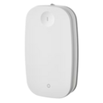

# ioBroker.ikea-rodret

**Tests:** 

## IKEA RODRET Dimmer (E2201) adapter for ioBroker

This adapter allows you to link **IKEA RODRET buttons** (wired push buttons) to **lights** in ioBroker. It supports **on/off control** and **dimming** using the `brightness_move` and `transition_time` states of lights.

Normally, the RODRET only sends a single “action” event (e.g. `brightness_move_up`) when the button is pressed,
so you would have to create your own JavaScript to achieve continuous dimming.

With this adapter you simply configure a target light, and the adapter will
brighten or dim it smoothly while you hold the button — no extra scripting required.

Currently, only certain device types are supported (see below).

## How it Works

1. The adapter **monitors RODRET button actions**.
2. For each configured RODRET device, it manages an associated light (root object).
3. When a button is pressed:
    - **ON/OFF actions** toggle the light.
    - **Brightness UP/DOWN actions** start dimming the light using `brightness_move`.
    - **STOP action** stops dimming.

### Dimming Logic

- **Dimming up**:
    - If the light is off, it is automatically switched on before dimming.
    - The light’s brightness increases continuously until:
        - Maximum brightness (100) is reached, or
        - The STOP action is triggered.

- **Dimming down**:
    - The light’s brightness decreases continuously.
    - When brightness reaches 0:
        - Dimming automatically stops.

## Required Objects / States

### RODRET Device

- **Parent object**: The RODRET button root object.
- **Required state**:
    - `.action` — indicates which button action was triggered.
- **Supported actions**:
    - `on` → Switch light on
    - `off` → Switch light off
    - `brightness_move_up` → Start brightening
    - `brightness_move_down` → Start dimming
    - `brightness_stop` → Stop dimming

> Other device types are **not supported** yet.

### Light Device

- **Root object**: The root object of the light in ioBroker.
- **Required states**:
    - **Switch state** (`role = switch`) — used for turning the light on/off.
- **Optional states for dimming**:
    - **Brightness move state** (`name = brightness_move` OR `role = level.dimmer.move`) — used to start/stop dimming continuously.
    - **Transition time state** (`name = transition_time`) — used to set the dimming speed.
    - **Level/Brightness state** (`name = level` OR `name = brightness` OR `role = level.dimmer`) — used to monitor brightness and automatically stop dimming at min/max.

> If a light **does not have `brightness_move` or level**, only on/off control will work.

## Configuration Settings

Each RODRET-light mapping requires the following settings:

| Setting      | Description                                                                                                                                  |
| ------------ | -------------------------------------------------------------------------------------------------------------------------------------------- |
| **rodretId** | The root object ID of the RODRET button.                                                                                                     |
| **lightId**  | The root object ID of the light. The adapter automatically discovers child states (`switch`, `brightness_move`, `transition_time`, `level`). |

### Optional adapter settings (per device)

> Note: You **do not need to configure moveSpeed or transitionTime**. The adapter reads `transition_time` from the light if available, and uses a default dim speed internally.

## Supported Devices

- **RODRET buttons** (IKEA) — wired push buttons.
- **Lights with switch state** — mandatory.
- **Lights with brightness_move & level** — supports dimming up/down with automatic stop.
- Other lights or devices without these states are **currently not tested/supported**.

## Notes

- The adapter **handles multiple RODRET-light pairs** independently.
- Dimming is **continuous** until max/min brightness or STOP is triggered.
- A single RODRET can control multiple lights, and multiple RODRETs can control the same light with coordinated access handling.

## Changelog

<!--
	Placeholder for the next version (at the beginning of the line):
	### **WORK IN PROGRESS**
-->
### 0.0.9 (2025-10-11)

- (asc-ii) fix: remove releases new from io-packages.json (adapter checker was complaining)

### 0.0.8 (2025-10-11)

- (asc-ii) feat: full n:m mapping support between RODRET and light devices — a single RODRET can now control multiple lights, and multiple RODRETs can control the same light with coordinated access handling.
- (asc-ii) fix: log message with undefined values
- (asc-ii) fix: translation in admin UI

### 0.0.7 (2025-10-05)

- (asc-ii) rework: using `brightness_move` state for dimming instead of custom timer settings

### 0.0.6 (2025-10-02)

- (asc-ii) fix logging
- (asc-ii) fix translations
- (asc-ii) update adapter image

### 0.0.5 (2025-10-02)

- (asc-ii) feat: supporting multiple devices per adapter

### 0.0.4 (2025-09-23)

- (asc-ii) feat: add verbose logging option
- (asc-ii) fix: ignoring empty light state
- (asc-ii) update admin layout

### 0.0.3 (2025-09-23)

- (asc-ii) remove debug function
- (asc-ii) add status logs

### 0.0.2 (2025-09-22)

- (asc-ii) fix translations

### 0.0.1 (2025-09-22)

- (asc-ii) initial release

## License

MIT License

Copyright (c) 2025 Adrian Schyja <asc-ii@gmx.net>

Permission is hereby granted, free of charge, to any person obtaining a copy
of this software and associated documentation files (the "Software"), to deal
in the Software without restriction, including without limitation the rights
to use, copy, modify, merge, publish, distribute, sublicense, and/or sell
copies of the Software, and to permit persons to whom the Software is
furnished to do so, subject to the following conditions:

The above copyright notice and this permission notice shall be included in all
copies or substantial portions of the Software.

THE SOFTWARE IS PROVIDED "AS IS", WITHOUT WARRANTY OF ANY KIND, EXPRESS OR
IMPLIED, INCLUDING BUT NOT LIMITED TO THE WARRANTIES OF MERCHANTABILITY,
FITNESS FOR A PARTICULAR PURPOSE AND NONINFRINGEMENT. IN NO EVENT SHALL THE
AUTHORS OR COPYRIGHT HOLDERS BE LIABLE FOR ANY CLAIM, DAMAGES OR OTHER
LIABILITY, WHETHER IN AN ACTION OF CONTRACT, TORT OR OTHERWISE, ARISING FROM,
OUT OF OR IN CONNECTION WITH THE SOFTWARE OR THE USE OR OTHER DEALINGS IN THE
SOFTWARE.
